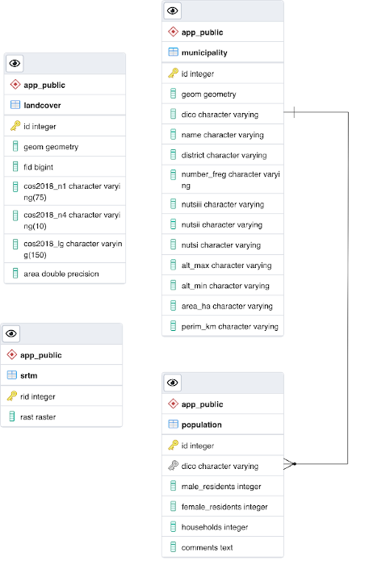
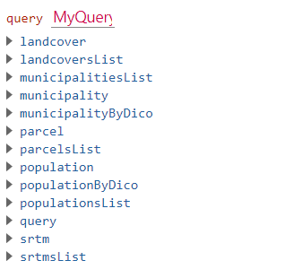
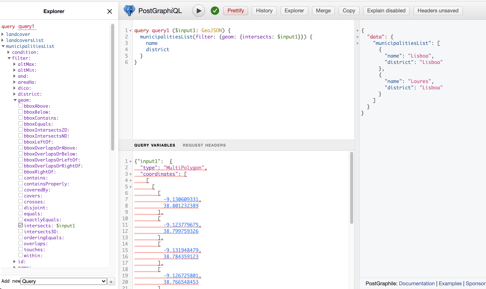

# **GraphQL meets PostGIS: a spatial API workshop**

### This workshop aims to explain and exemplify the use of PostGraphile and PostgreSQL to generate a spatial GraphQL API.

----------
## What you will learn

By the end of this workshop you will know how to:

- generate a complete GraphQL API from an existing PostgreSQL/PostGIS database, without writing any application code;
- query spatial data through GraphQL, getting geometries as GeoJSON and using spatial filters;
- shape the API (rename, hide and document things) with smart tags, without changing the data model;
- extend the API with PostgreSQL functions, from computed columns to raster statistics and custom spatial queries;
- secure the API with JWT authentication, role based access control and row level security, all enforced by PostgreSQL itself.

----------
## Table of contents

1) [Start the environment and meet the database](#1---start-the-environment-and-meet-the-database)
2) [Using PostGraphile](#2---using-postgraphile)
3) [Pagination](#3---pagination)
4) [Filters](#4---filters)
5) [Smart tags](#5---smart-tags)
6) [Extending the schema](#6---extending-the-schema)  
	6.1) [Computed columns](#61---computed-columns)  
	6.2) [Custom queries](#62---custom-queries)
7) [CRUD Mutations](#7---crud-mutations)
8) [Authentication](#8---authentication)


----------
## Before the workshop (try to do this at home)

Event wifi is usually slow and shared, so please prepare your machine in advance. It should take around 15 minutes, most of it waiting for downloads.

**Zero-install alternative:** you can run everything in the browser with [GitHub Codespaces](#running-in-github-codespaces); no local installs, just a GitHub account and a steady internet connection. If you go that route, this checklist does not apply: create your codespace once before the workshop instead, because its first start takes a few minutes.

1. Install Docker: [Docker Desktop](https://docs.docker.com/desktop/) on Windows and macOS, [Docker Engine](https://docs.docker.com/engine/install/) or Docker Desktop on Linux. On Windows you need administrator rights for the installation, and Docker Desktop runs on WSL 2, which its installer can set up for you. On Linux with Docker Engine, also install the Compose and Buildx plugins (the packages `docker-compose-plugin` and `docker-buildx-plugin` in Docker's own repositories) and add your user to the `docker` group.
2. Start Docker and check that Docker Compose is version 2 or newer:

   ```shell
   docker compose version
   ```

3. Get a copy of this repository into a normal local folder (not a network drive, and not a folder that a cloud service keeps synchronised):

   ```shell
   git clone --depth 1 https://github.com/lcalisto/workshop-spatial-graphql.git
   cd workshop-spatial-graphql
   ```

   No git? Use **Code > Download ZIP** on the GitHub page of the repository, unpack the file and open a terminal in the unpacked folder, the one that holds `docker-compose.yml`.
4. Start the workshop environment once, while you have good internet:

   ```shell
   docker compose up -d
   ```

   This first start downloads about 0.6 GB, so it takes a few minutes and needs about 3 GB of free disk space. Later starts take seconds, and on the day nothing has to be downloaded.
5. Open [http://localhost:5001](http://localhost:5001) (GraphiQL) and [http://localhost:5050](http://localhost:5050) (pgAdmin) in your browser. pgAdmin takes the longest to start: if its page does not load yet, wait about ten seconds and reload. If both pages load, you are ready.
6. Stop the environment until the workshop. Nothing is lost:

   ```shell
   docker compose stop
   ```

On the day, start Docker and run `docker compose up -d` again in the same folder.

If you update your copy of the repository later (`git pull` or a new ZIP), reset the environment with `docker compose down -v` followed by `docker compose up -d`. Docker downloads any workshop image that changed, and the database goes back to its initial state.

If something fails, no stress, we will sort it out together at the start of the session. The list under [If something goes wrong](#if-something-goes-wrong) covers the usual problems.

----------
## What is GraphQL?

*GraphQL is a query language for your API. GraphQL isn't tied to any specific database or storage engine and is instead backed by your existing code and data.*

*A GraphQL service is created by defining types and fields on those types, then providing functions for each field on each type.*

### Coming from REST?

If you have used REST APIs before, this mapping may help:

- A REST API exposes many endpoints (`/municipalities`, `/municipalities/153`, ...), each returning a fixed structure. A GraphQL API exposes a **single endpoint** that accepts queries.
- In REST the **server** decides what each response contains. In GraphQL the **client** asks for exactly the fields it needs and the response mirrors the query, so related data (a municipality and its population) comes in one request instead of several.
- Instead of HTTP verbs, GraphQL uses **queries** to read and **mutations** to write.
- The schema is **typed and self-documenting**; tools like GraphiQL use it to offer autocomplete and browsable documentation, as we will see during the workshop.

If you are new to GraphQL it might be good to check the official documentation: https://graphql.org/learn/

----------

## Requirements

Docker runs everything in this workshop, so the list is short:

- **Docker**, with Docker Compose version 2 or newer. It runs PostgreSQL with PostGIS, PostGraphile and pgAdmin for you; you do not install any of them.
- **A text editor**, for the one small file we edit during the workshop. Any editor works. One that comments and uncomments a line with Ctrl+/ (Cmd+/ on macOS), such as VS Code, is handy.
- **A web browser**, for GraphiQL and pgAdmin.
- **QGIS** (optional), for exploring spatial features.

The [Before the workshop](#before-the-workshop-try-to-do-this-at-home) checklist above installs Docker and starts the environment. There are three ways to follow the workshop: Docker Compose on your own machine, which is the default and what this README describes; GitHub Codespaces (below), which runs the same environment in the cloud with zero local installs; and your own PostgreSQL and NodeJS without Docker, explained in [Requirements.md](Requirements.md).

### Running in GitHub Codespaces

A codespace runs the same Docker Compose environment as your own machine, in the cloud. It starts the environment for you, so skip the `docker compose up -d` step of section 1. The steps below list what else is different; the rest of this README applies as written.

1. On the GitHub page of this repository choose **Code > Codespaces > Create codespace on main**.
2. The first start downloads the workshop images, which takes a few minutes. In the terminal of the codespace, run `docker compose ps` until it lists three services, with `(healthy)` next to `db`.
3. Open the **Ports** tab and open ports 5001 (GraphiQL) and 5050 (pgAdmin) in the browser. Use those two addresses in your browser wherever this README says `http://localhost:5001` or `http://localhost:5050`. Commands that you run in the terminal of the codespace, such as the `curl` example of the wrap-up, keep `localhost`. The finished workshop of the wrap-up is port 5002 in the same tab.
4. From here on, whenever this README asks you to edit `postgraphile/config.js`, do it in the editor of the codespace, and run the `docker compose` commands in its terminal.

To use a desktop GUI like pgAdmin or QGIS against the Codespace's database, use the [GitHub CLI](https://cli.github.com/) to open a real local TCP tunnel (the browser's "Ports" panel only proxies HTTP(S); it cannot carry the raw Postgres wire protocol).

If you don't already have the GitHub CLI installed:

```shell
# Windows (winget)
winget install --id GitHub.cli

# macOS (Homebrew)
brew install gh

# Linux (Ubuntu; see https://github.com/cli/cli/blob/trunk/docs/install_linux.md for other distros)
sudo apt install gh
```

Then authenticate once with `gh auth login`, and add the Codespaces permission to your token (the default login does not include it):

```shell
gh auth refresh -h github.com -s codespace
```

Run the first command to find the name of your codespace. Then leave the second one running, with that name in place of `<codespace-name>`, and point your desktop tool at `localhost:15432`, with user `postgres`, password `postgis` and database `workshop_graphql`:

```shell
gh codespace list
gh codespace ports forward 15432:15432 -c <codespace-name>
```

----------

## 1 - Start the environment and meet the database

In order to start the workshop we will use an existing database. The idea is to show how you can use one existing spatial database and generate a GraphQL API on top of it.

Open a terminal in the folder of this repository and start the environment (in Codespaces it is already running):

```shell
docker compose up -d
```

If you went through the [Before the workshop](#before-the-workshop-try-to-do-this-at-home) checklist, this takes a few seconds. Otherwise Docker first downloads about 0.6 GB, which takes a few minutes. Either way, the command starts three containers (Docker Compose calls them services):

| What | Where | Notes |
| ---- | ----- | ----- |
| GraphiQL and the GraphQL API (PostGraphile) | [http://localhost:5001](http://localhost:5001) | we use it from section 2 on |
| pgAdmin | [http://localhost:5050](http://localhost:5050) | no login; the workshop database is already registered |
| PostgreSQL with PostGIS | `localhost:15432` | for QGIS or psql: user `postgres`, password `postgis`, database `workshop_graphql` |

Check that they are running:

```shell
docker compose ps
```

You should see the three services `db`, `pgadmin` and `postgraphile` with a status that starts with `Up`, and `(healthy)` next to `db`. If something looks different, see [If something goes wrong](#if-something-goes-wrong).

The database is already there: it was restored when the database image was built, so there is nothing to create or import.

### A first look with pgAdmin

1. Open [http://localhost:5050](http://localhost:5050). There is no login. If the page does not load yet, pgAdmin is still starting: wait about ten seconds and reload.
2. In the tree on the left, open **Servers > Workshop database > Databases > workshop_graphql > Schemas**. pgAdmin does not ask for a password.
3. Open **app_public > Tables**. You should see the five tables described below.
4. To run SQL, right click the `workshop_graphql` database and choose **Query Tool**. We will use it from section 5 on.

Two commands worth knowing: `docker compose stop` stops the environment and keeps your work, and `docker compose up -d` brings it back. If you ever want to start again from the initial database, see [Lost? Reset in three steps](#lost-reset-in-three-steps).

Note: the database uses the **postgis** and **postgis_raster** extensions; both are part of the database image.

### Existing database


The database has 5 tables (in the app_public schema) and 4 schemas:
- **municipality**, Spatial table with the municipalities of mainland Portugal, from the official administrative map [CAOP](https://www.dgterritorio.gov.pt/atividades/cartografia/cartografia-tematica/caop) (Direção-Geral do Território);
- **population**, Non-spatial table with population per municipality, from the [INE 2021 Census](https://censos.ine.pt/) preliminary results;
- **parcels**, Spatial table used to collect polygons during a field campaign;
- **landcover**, Spatial (vector) table with landcover for the Lisbon region from [Corine 2018](https://land.copernicus.eu/en/products/corine-land-cover/clc2018);
- **srtm**, Spatial (raster) table with [NASA SRTM](https://en.wikipedia.org/wiki/Shuttle_Radar_Topography_Mission) elevation for the Lisbon region.




#### Schemas

As mentioned [here](https://postgraphile.org/postgraphile/4/namespaces/) 

- **app_public**, Tables and functions to be exposed to GraphQL (or any other system) - it's your public interface. This is the main part of your database.
- **app_private**, No-one should be able to read this without a SECURITY DEFINER function letting them selectively do things. This is where you store passwords (bcrypted), access tokens (hopefully encrypted), etc.
- **public**, Should be empty, used only as a default location for PostgreSQL extensions.
- **postgraphile_watch**, PostGraphile's watch fixtures, already included in the workshop database so that schema watching (the `watch` option) can still work in section 8, when the server connects with a non-superuser role. PostGraphile will still print a "Failed to setup watch fixtures" warning at that startup; it is expected and safe to ignore.


----------

## 2 - Using PostGraphile

In order to implement a spatial GraphQL API we will make use of PostGraphile (https://www.graphile.org). If you never used PostGraphile we recommend to check its [documentation](https://postgraphile.org/postgraphile/4/). We also recommend these cheatsheets: https://learn.graphile.org/ 

Part of this workshop was based on PostGraphile docs.

### PostGraphile usage forms

According to the documentation PostGraphile is formed of three forms of usage:

- **CLI**, the most user-friendly;

- **Library**, it gives more power than using the CLI, suitable for **Node.js** with **Connect**, **Express** or **Koa** applications;
  
- **Schema-only**, deepest layer which contains all the types, fields and resolvers.

**At this workshop we will use the CLI.** It runs in the `postgraphile` container that `docker compose up -d` started, so there is nothing to install. Section 3 has a short note on library usage.

You can check the official docs for more information on how to use the CLI, https://postgraphile.org/postgraphile/4/usage-cli/


**Note:** PostGraphile v5 is now the latest major version, with a different CLI and plugin system. This workshop targets the v4 line: the container runs PostGraphile 4.14.1, and the documentation links in this README point to the v4 pages.

### Plugins
PostGraphile can be customized using plugins. You can find more info about this on [GraphQL Schema Plugins](https://postgraphile.org/postgraphile/4/extending/).

We will make use of the following plugins:

- **@graphile-contrib/pg-simplify-inflector**, more info [here](https://github.com/graphile/pg-simplify-inflector)
- **@graphile/postgis** - Adds postgis support to PostGraphile, more info [here](https://github.com/graphile/postgis)
- **postgraphile-plugin-connection-filter** - Adds a powerful filtering to PostGraphile, more info [here](https://github.com/graphile-contrib/postgraphile-plugin-connection-filter)
- **postgraphile-plugin-connection-filter-postgis** - Adds spatial filtering mechanisms into PostGraphile and the above plugin, more info [here](https://github.com/graphile-contrib/postgraphile-plugin-connection-filter-postgis).

They are already installed in the `postgraphile` container, at the exact versions listed in [compose/postgraphile/package.json](compose/postgraphile/package.json).

More info about plugins can be found on [PostGraphile community plugins](https://postgraphile.org/postgraphile/4/community-plugins/)

----------

### The configuration file

PostGraphile is already running: `docker compose up -d` started it. Its options could be given as flags on a long command line; here they are in a configuration file instead, [postgraphile/config.js](postgraphile/config.js). It is the only file you edit in this workshop. Open it in your text editor and read it once: every option has a comment above it.

PostGraphile reads this file only when it starts. So after every change to the file, save it and restart PostGraphile:

```shell
docker compose restart postgraphile
```

The restart takes about a second. Changes made in the database are different: thanks to the `watch` option they appear in the API without a restart.

Two lines near the end of the file are prepared for later, one for section 3 and one for section 8. Leave them as they are for now.

<details>
<summary><b>What do all these options do?</b></summary>

Each option is the camelCase form of a PostGraphile CLI flag: `--simple-collections` becomes `simpleCollections`.

- `connection`, the PostgreSQL connection string (who connects, and to which database). In it, `db` is the name of the database container.
- `schema`, the schemas exposed to GraphQL; only `app_public` here.
- `watch`, watches the database and updates the GraphQL schema automatically, so our SQL changes appear without restarting PostGraphile.
- `simpleCollections`, set to `only`, it generates simple list fields (like `municipalitiesList`) instead of cursor connections; see section 3.
- `appendPlugins`, loads the four plugins listed above.
- `skipPlugins`, removes the Relay global `Node` interface, giving a smaller and simpler schema.
- `graphiql`, serves the GraphiQL IDE at the root URL.
- `enhanceGraphiql`, enables the full-featured GraphiQL (explorer sidebar, history and more).
- `allowExplain`, lets GraphiQL show the PostgreSQL execution plan of each query.
- `subscriptions`, enables the GraphQL subscriptions infrastructure (websockets); not used in this workshop but harmless to keep on.
- `dynamicJson`, exposes JSON values as raw JSON instead of strings.
- `setofFunctionsContainNulls`, set to `false`, it declares that our set-returning functions never return null rows, which gives cleaner (non-nullable) types.
- `ignoreRbac`, set to `false`, it only exposes what the connecting role is actually allowed to access; we rely on this in section 8.
- `legacyRelations`, set to `omit`, it skips deprecated duplicate relation fields.
- `enableQueryBatching`, allows clients to send several operations in one HTTP request.
- `showErrorStack`, adds the JavaScript stack trace to error responses; great while learning, avoid in production.
- `extendedErrors`, adds the PostgreSQL hint, detail and error code to error responses; great while learning, avoid in production.

Three more options sit in the `section8` block at the top of the file, next to the `connection` that section 8 uses. They only take effect in section 8:

- `defaultRole`, the PostgreSQL role used for requests that carry no JWT (JSON Web Token).
- `jwtSecret`, the secret that signs and verifies the JWTs.
- `jwtTokenIdentifier`, the PostgreSQL type that PostGraphile turns into a JWT.

The address and the port that PostGraphile listens on are not in the file. Inside its container PostGraphile listens on port 5000, and [docker-compose.yml](docker-compose.yml) publishes it on your machine as port 5001.

</details>

This configuration generates a minimal schema, since we are omitting the NodePlugin, with the advanced filter mechanism and the PostGIS support given by the plugins from above.

A note on the file format: PostGraphile 4 looks for its configuration under the name `.postgraphilerc.js` and marks that format as deprecated. The small file [postgraphile/.postgraphilerc.js](postgraphile/.postgraphilerc.js) only loads `config.js`. PostGraphile 5 is configured through a file as well, in a different format (`graphile.config.mjs`).

### Explore the interface and current schema

Point your browser to [http://localhost:5001](http://localhost:5001) and give it a first try. This interface is GraphiQL, a GraphQL IDE. Take a minute to find your way around it:

- The central panel is the **query editor**; the **play button** (or Ctrl+Enter) runs the current operation.
- The **Explorer** panel on the left builds queries for you as you tick fields, a great way to discover the schema.
- The **Docs** button opens the schema documentation, generated automatically from the database (including our SQL comments, as we will see later).
- At the bottom of the editor you will find the **QUERY VARIABLES** and **REQUEST HEADERS** tabs; we will need variables in section 4 and headers in section 8.

PostGraphile automatically adds a number of elements to the generated GraphQL schema based on the tables and columns found in the inspected schema. For the tables from the app-public schema, it creates:

- **singularized and pluralized table types**, the singularized type, such as `landcover`, can be used to query a single record by the primary key, in this case, `id`. The pluralized type, such as `landcoversList`, can be used to query multiple records.

- **related table types**, such as `municipalityByDico`.
  
- **the root Query type**, 




### First queries

Now that we setup our initial API let's query it:


- Query municipality with `ID 153`

```graphql
{
  municipality(id:153){
    name
    district
  }
}
```

- Query municipality with `ID 153` and get its population. Don't forget population table is related to the `municipalities` using attribute `DICO` .

```graphql
{
  municipality(id:153){
    name
    district
    populationByDico{
      households
      femaleResidents
      maleResidents
    }
  }
}
```

- Get all municipalities. Notice that plural connections are generated automatically `municipalitiesList`.


```graphql
{
  municipalitiesList{
    name
    district
  }
}
```

- Get all municipalities and its population.

```graphql
{
  municipalitiesList{
    name
    district
    populationByDico{
      femaleResidents
      maleResidents
      households
    }
  }
}
```

- Get `first 10` municipalities and its population.

```graphql
{
  municipalitiesList(first:10){
    name
    district
    populationByDico{
      femaleResidents
      maleResidents
      households
    }
  }
}
```

- Get all parcels.

```graphql
{
  parcelsList{
    name
    createdBy
  }
}
```
### Spatial queries

It's now time to go spatial! You can always view the spatial features in [https://geojson.io](https://geojson.io) Alternatively you can save the geometry as a geojson file and use **QGIS** by opening the geojson file.

- Get the geometry as geojson and the SRID from the first municipality.

```graphql
{
  municipalitiesList(first:1) {
    name
    district
    geom{
      srid
      geojson
    }
  }
}
```
- Get the geometry as geojson and the SRID from the first parcel.

```graphql
{
  parcelsList(first:1){
    name
    createdBy
    geom{
      srid
      geojson
    }
  }
}

```

#### Geometry decomposition.

PostGraphile automatically generates sub geometries, the next query shows how that can be achieved out of the box. Parcels geom column is MultiPolygon data type, therefore we can generate all sub-geometries that compose MultiPolygon.

```graphql
{
  parcelsList(first:1){
    name
    createdBy
    geom{
      srid
      geojson
      polygons{
        exterior{
          geojson
          points{
            geojson
            x
            y
          }
        }
      }
    }
  }
}

```

### If something goes wrong

- **First, look at what is running.** `docker compose ps -a` lists the three services and their state (without `-a`, a service that is not running is left out), and `docker compose logs postgraphile` shows what PostGraphile printed. The log mentions `http://0.0.0.0:5000/`: that is the address inside the container. In your browser it is `http://localhost:5001`.
- **Docker answers `no configuration file provided: not found`.** Your terminal is not in the folder of this repository. Change to that folder, the one that holds `docker-compose.yml`, and run the command again.
- **A port is already in use.** Docker reports it when you start the environment, with a message that names the port; depending on the system it says `port is already allocated`, `address already in use` or `ports are not available`. Open [docker-compose.yml](docker-compose.yml), find the line with that port (5001, 5050 or 15432) and change only its middle number, for example `127.0.0.1:5001:5000` to `127.0.0.1:5011:5000`. Run `docker compose up -d` again and use 5011 wherever this README says 5001. If you do not know what is using the port, `docker compose ls` lists the Compose environments that are running on your machine.
- **GraphiQL stops working after an edit of `postgraphile/config.js`.** There is probably a typo in the file. `docker compose logs postgraphile` shows the file name, the line and a `SyntaxError`. Fix the file, then run `docker compose restart postgraphile`.
- **You edited `postgraphile/config.js` and nothing changed.** PostGraphile reads the file only when it starts, and `docker compose up -d` does not restart a container that is already running. Run `docker compose restart postgraphile`. If that changes nothing either, check that you saved the file, and that the file you edited is `config.js` and not `config.final.js`.
- **The logs say `password authentication failed for user "app_postgraphile"`.** The section 8 line of `postgraphile/config.js` is active, but the database does not have that role yet: you are before section 8, or you reset the database. Put the two slashes back at the start of that line, or run the SQL of section 8 first. Then restart PostGraphile.
- **The GraphiQL page stays blank for a long time.** Before it shows anything, the page waits for two scripts from unpkg.com (about 0.7 MB together), so it is slow on poor wifi. GraphiQL only uses them for its Prettify button, and the API itself does not need the internet.
- **Docker builds the images instead of downloading them.** The workshop images come from the GitHub Container Registry (`ghcr.io`). When Docker cannot download them, for example because the network blocks `ghcr.io` or `pkg-containers.githubusercontent.com`, it reports the failed download and builds the images on your machine instead; it can wait a minute for the download to fail before it starts. The build takes a few minutes and about 0.3 GB of downloads from Docker Hub and other sites, and gives the same environment. An old login to `ghcr.io` that has expired can also cause this: run `docker logout ghcr.io` and try again.
- **Docker reports `toomanyrequests`.** Docker Hub limits how many images one network address can download without an account, and a room full of people behind the same wifi can reach that limit. Run `docker login` with a free Docker account and try again, or use [GitHub Codespaces](#running-in-github-codespaces).
- **On Linux, Docker Compose asks for Buildx.** Install the Buildx plugin (the package `docker-buildx-plugin` in Docker's own repositories) and run the command again.
- **On Linux, `permission denied` on the Docker socket.** Add your user to the `docker` group, then log out of your Linux session and log in again, or run the commands with `sudo`.
- **"Failed to setup watch fixtures" warning in the logs.** Expected when PostGraphile connects with a non-superuser role (section 8) and safe to ignore.

### Lost? Reset in three steps

If at any point your database no longer matches the workshop, you can rebuild it to the exact point you need:

1. Delete your database and start again from the initial one:

   ```shell
   docker compose down -v
   docker compose up -d
   ```

   This takes a few seconds. pgAdmin starts from scratch too: give it about ten seconds, then reload its page in the browser.
2. Open [compose/db/init/01-after-workshop.sql](compose/db/init/01-after-workshop.sql) in your text editor. It replays all the SQL of this README in order. Copy everything from the top down to the "end of section N" marker where you want to resume, paste it into the Query Tool of pgAdmin and run it. The first SQL of the workshop is in section 5, so there is nothing to replay before that.
3. Make [postgraphile/config.js](postgraphile/config.js) match that point. The section 3 line starts with its two slashes. The section 8 line also starts with its two slashes, unless you replayed down to the end of section 8. Save the file, then run `docker compose restart postgraphile`.

**Note:** `docker compose down -v` deletes the database but never touches your edits of `postgraphile/config.js`; the file [postgraphile/config.final.js](postgraphile/config.final.js) shows how it looks at the end of section 8. The SQL file does not recreate the section 8 users, since they are created through GraphQL mutations. If you reset during section 8, run the `m1`, `m2` and `m3` mutations again; on a fresh database they get ids 1, 2 and 3.

 ----------
## 3 - Pagination


We will not focus on this workshop on pagination but it is a very important concept in GraphQL, we recommend reading https://graphql.org/learn/pagination/ to better understand how pagination can be handled in GraphQL.

As you might have noticed on the [first queries](#first-queries) we started querying one municipality and end up with plural connections which are part of the pagination concept. 

### More queries

- Using **offset**

The following query returns the 10 records after the first 10 records.

```graphql
{
  municipalitiesList(first:10, offset:10){
    name
    district
    populationByDico{
      femaleResidents
      maleResidents
      households
    }
  }
}
```

#### Cursor Connections

In order to have some simplicity we deactivated cursor connections these type of connections come from the [Cursor Connections Specification](https://relay.dev/graphql/connections.htm) for more information you should read this specification since they can be quite useful. Cursor connections allows perform cursor-based pagination, and is seen as a GraphQL best practice.

The `simpleCollections` option in `postgraphile/config.js` controls how PostGraphile generates `collections`:

`simpleCollections: "omit"` - PostGraphile generates cursor connections only;

`simpleCollections: "only"` - simple collections only (no cursor connections);

`simpleCollections: "both"` - both cursor and simple connections.

You can try to activate both cursor and simple connections. Open [postgraphile/config.js](postgraphile/config.js) and find the line prepared for section 3, near the end of the file. Delete the two slashes at the start of that line, so that it reads `simpleCollections: "both",`, and save the file. The line repeats an option that is already set higher up in the file; the later one wins. Then restart PostGraphile:

```shell
docker compose restart postgraphile
```

Reload GraphiQL, explore the schema and check the differences: next to `municipalitiesList` there is now `municipalities`, a cursor connection with `nodes`, `edges`, `pageInfo` and `totalCount`.

During this workshop we won't use cursor connections anymore. To remove them, put the two slashes back at the start of that line, save the file and restart PostGraphile again.

### Note for Library usage

If you, just like me, prefer simple collections but don't like the `List` suffix on them, you can remove it with the build option `pgOmitListSuffix`. In library usage you add `{graphileBuildOptions: {pgOmitListSuffix: true}}` to the options passed to PostGraphile. The CLI has no flag for it, but the configuration file accepts the same setting: a line `graphileBuildOptions: { pgOmitListSuffix: true },` inside `options`, followed by a restart. Do not keep it switched on, though: the queries in the rest of this workshop use the `List` names.

----------
## 4 - Filters

PostGraphile supports rudimentary filtering on connections using a **condition argument**. This condition mechanism is very limited and **does not support spatial** filtering. Therefore we will use instead [connection-filter plugin](https://github.com/graphile-contrib/postgraphile-plugin-connection-filter) that is already installed in the `postgraphile` container and has advanced filter capabilities, including spatial filtering based on [postgraphile-plugin-connection-filter-postgis](https://github.com/graphile-contrib/postgraphile-plugin-connection-filter-postgis).

- Query all parcels that have `benfica` :stadium: in its name.
  
```graphql
{
  parcelsList(filter: {name: {includesInsensitive: "benfica"}}) {
    name
    createdBy
  }
}

```

- Query all parcels created by `user1`:
  
```graphql
{
  parcelsList(filter: {createdBy: {like: "user1"}}) {
    name
    createdBy
  }
}
```


- Query all municipalities from Lisbon district:
  
```graphql
{
  municipalitiesList(filter: {district: {like: "Lisboa"}}) {
    name
    district
  }
}
```

- Query all municipalities **in** a list of districts
  
```graphql
{
  municipalitiesList(filter: {district: {in: ["Lisboa","Porto"]}}) {
    name
    district
    populationByDico {
      households
    }
  }
}
```

More filter operations can be found [here](https://github.com/graphile-contrib/postgraphile-plugin-connection-filter/blob/main/docs/operators.md).

### Spatial filters

Since we have [postgraphile-plugin-connection-filter-postgis](https://github.com/graphile-contrib/postgraphile-plugin-connection-filter-postgis) we can use spatial filters. Please take some time exploring available geometry filters in Graphiql IDE.

```graphql
{
  municipalitiesList(
    filter: {
      geom: {
        bboxIntersects2D: {
          type: "Polygon"
          coordinates: [
            [
              [-9.253921508789062, 38.70855351447061]
              [-9.185256958007812, 38.70855351447061]
              [-9.185256958007812, 38.74497964505743]
              [-9.253921508789062, 38.74497964505743]
              [-9.253921508789062, 38.70855351447061]
            ]
          ]
        }
      }
    }
  ) {
    name
    district
  }
}

```

#### Using variables 

We will now get all municipalities (from municipality table) that intersect Lisbon Airport. But at the same time we will show how to use variables.

- First lets get Lisbon Airport geojson

```graphql
{
  parcelsList(first: 1, filter: { name: { like: "Lisbon airport" } }) {
    name
    createdBy
    geom {
      geojson
    }
  }
}

```

You should get the following geojson result from the previous query. Please add it to https://geojson.io and confirm its location.

```json
{
	"type": "MultiPolygon",
	"coordinates": [
		[
			[
				[
					-9.130609331,
					38.801232389
				],
				[
					-9.123779675,
					38.799759326
				],
				[
					-9.131948479,
					38.784359123
				],
				[
					-9.126725801,
					38.766548453
				],
				[
					-9.129805842,
					38.763200583
				],
				[
					-9.149223489,
					38.765611049
				],
				[
					-9.130609331,
					38.801232389
				]
			]
		]
	]
}
```

- Next lets write a query with one input variable, in this case variable name is `input1` of type GeoJSON. On this particular example we name our query `query1`.

```graphql
query query1 ($input1: GeoJSON) {
  municipalitiesList(filter: {geom: {intersects: $input1}}) {
    name
    district
  }
}
```

Now we need to insert the variable, to achieve that please insert below code into QUERY VARIABLES 

```JSON
{"input1":  {
	"type": "MultiPolygon",
	"coordinates": [
		[
			[
				[
					-9.130609331,
					38.801232389
				],
				[
					-9.123779675,
					38.799759326
				],
				[
					-9.131948479,
					38.784359123
				],
				[
					-9.126725801,
					38.766548453
				],
				[
					-9.129805842,
					38.763200583
				],
				[
					-9.149223489,
					38.765611049
				],
				[
					-9.130609331,
					38.801232389
				]
			]
		]
	]
} }
```
You should have something like the image below



As we can see Lisbon Airport is on 2 Municipalities: Lisbon and Loures.

----------
## 5 - Smart tags

It's possible to customise PostGraphile GraphQL schema by using tags on our database tables, columns, functions etc. These can rename, omit, etc from the GraphQL schema. In other words, it allows us to change the GraphQL schema without changing the database data model.

More information on Smart tags and how to use them can be found here: https://postgraphile.org/postgraphile/4/smart-tags/

> **Heads up:** from here on we rename and hide things in the schema. Any queries you wrote against the old names (for example `landcoversList`) will stop working as written; that is the whole point of this section. The [reset box](#lost-reset-in-three-steps) is there if you need it.

#### Omit
Lets run the following SQL code using pgAdmin (the Query Tool). Check what happens on the GraphQL schema.

```sql 
comment on table app_public.municipality is E'@omit';
```

As you realized all connections to municipality have been removed, although at the database level we only added one comment, nothing changed the DB.

We can remove the smart tag and revert its effect by simply remove the previous comment.

```sql 
comment on table app_public.municipality is NULL;
```

Lets now omit SRTM from our schema because its a raster dataset. We'll access it using a different technique.


```sql 
comment on table app_public.srtm is E'@omit';
```

#### Rename

In order to rename an object we can use **@name**. Please run the following to rename our table `landcover`.

```sql
comment on table app_public.landcover is E'@name clc_landcover';
```

Notice that `clc_landcover` was changed into `clcLandcover`. 

**Columns** can also be renamed.

```sql
comment on column app_public.landcover.label3 is E'@name label';
```


Moving forward on our schema simplification lets now rename a constraint (relationship) in order to have clear names. Please run the following example and check what happens in your schema, inside `population` and `municipality`.

```sql
comment on constraint population_dico_fkey on app_public.population is
  E'@foreignFieldName population\n@fieldName municipality\nDocumentation here.';
```
----------
## 6 - Extending the schema

One of the most important capabilities of PostGraphile is the ability to extend GraphQL schema using functions. This gives us the ability to use the power of PostgreSQL & PostGIS to generate any processing algorithms.
### 6.1 - Computed columns

From the [docs](https://postgraphile.org/postgraphile/4/): *"Computed columns" add what appears to be an extra column (field) to the GraphQL table type, but, unlike an actual column, the value for this field is the result of calling a function defined in the PostgreSQL schema. This function will automatically be exposed to the resultant GraphQL schema as a field on the type; it can accept arguments that influence its result, and may return either a scalar, record, list or a set.

#### Parcels area

In this example we will generate an extra field on the parcels connection which give us the area of that parcel.

```sql
create or replace function app_public.parcels_area(p app_public.parcels)
returns real as $$
  select ST_Area(p.geom,true);
$$ language sql stable;
```

GraphQL query:
```graphql
{
  parcelsList(first: 2) {
    name
    area
  }
}
```

**Also works with filters.** Note: if you set the `ignoreIndexes` option to `false` (`--no-ignore-indexes` in the CLI), PostGraphile removes filters (and ordering) on columns that lack an index (that would break some of the section 4 examples); computed-column filters like this one keep working.
```graphql
{
  parcelsList(filter: {area: {greaterThan: 300000}}) {
    name
    area
  }
}
```


#### Landcover

On the next example we will generate an extra field on the parcels connection which give us one array with all intersecting landcover types.

```sql
create or replace function app_public.parcels_clc_landcover(p app_public.parcels)
returns varchar[] as $$
SELECT array_agg(distinct l.label3)
FROM app_public.landcover AS l
WHERE ST_Intersects(p.geom,l.geom)
$$ language sql stable;
```

GraphQL query:
```graphql
{
  parcelsList(first: 2) {
    name
    area
    clcLandcover
  }
}
```

**With filters**, get all parcels that intersect `Green urban areas`

```graphql
{
  parcelsList(filter: {clcLandcover: {contains: "Green urban areas"}}) {
    name
    area
    clcLandcover
  }
}
```


#### SRTM

On the next example we will generate extra fields on the parcels connection which give **SRTM raster statistics**.


```sql
DROP TYPE IF EXISTS srtm_stats CASCADE;

CREATE TYPE srtm_stats AS (
  "min" real,
  "max" real,
  "mean" real
);

create or replace function app_public.parcels_srtm(p app_public.parcels)
returns setof srtm_stats as $$
WITH t AS (
  SELECT st_summarystats(ST_Union(ST_Clip(r.rast, ST_Transform(p.geom,3763),true))) as stats
  FROM app_public.srtm AS r
  WHERE ST_Intersects(ST_Transform(p.geom,3763),r.rast)
)
SELECT (stats).min,(stats).max,(stats).mean FROM t;
$$ language sql stable;
```

For more information on **how to use raster data inside PostGIS** you can check my [workshop-postgis-raster](https://github.com/lcalisto/workshop-postgis-raster).

GraphQL query:
```graphql
{
  parcelsList {
    name
    area
    srtmList {
      min
      max
      mean
    }
  }
}
```

With filters:

```graphql
{
  parcelsList(filter: { name: { includesInsensitive: "benfica" } }) {
    name
    area
    srtmList {
      min
      max
      mean
    }
  }
}
```


**To discuss:** What is the difference between a **computed column** and a PostgreSQL [**generated column**](https://www.postgresql.org/docs/current/ddl-generated-columns.html)?
### 6.2 - Custom queries

While Computed columns generate one extra field on a specific connection, custom queries can add root-level Query fields to our GraphQL schema. This can be quite important while generating our API specially for processing algorithms.
#### Get Landcover 

On this example we are going to generate a custom query where the user can insert a GeoJSON with a geometry and a distance. It will return all landcover rows that intersect that geometry. If distance is specified the search radius will include that distance using a Buffer (ST_Buffer) around the specified geometry.

```sql
create or replace function app_public.get_landcover(geometry JSON, distance real DEFAULT NULL)
returns SETOF app_public.landcover as $$
declare
   g_geom geometry;
BEGIN
	IF distance IS NOT NULL AND distance > 0 THEN
	  IF distance > 10001  THEN
		RAISE EXCEPTION 'Maximum allowed distance for this operation is 10 km.';
	  ELSE
		g_geom=ST_SetSRID(st_buffer(ST_GeomFromGeoJSON(geometry)::geography,distance)::geometry,4326);
	  END IF;
	ELSE
	g_geom=ST_SetSRID(ST_GeomFromGeoJSON(geometry),4326);
	END IF;
	
RETURN QUERY
	SELECT *
	FROM app_public.landcover AS l
	WHERE ST_Intersects(g_geom,l.geom);
END;
$$ language plpgsql stable;
```


GraphQL query:
```graphql
{
  getLandcoverList(
    geometry: { type: "Point", coordinates: [-9.1615, 38.7122] }
    distance: 1000
  ) {
    label
  }
}
```
----------

## 7 - CRUD Mutations


From the [docs](https://postgraphile.org/postgraphile/4/crud-mutations/): *CRUD stands for "Create, Read, Update, Delete", is a common paradigm in data manipulation APIs; "CRUD Mutations" refer to all but the "R". PostGraphile will automatically add CRUD mutations to the schema for each table; this behaviour can be disabled via the `--disable-default-mutations` CLI setting.*

According to GraphQL convention, any operation that cause change should be sent explicitly via a mutation. Mutations in GraphQL change data, like inserting data into a database or altering data already in a database.

#### Create

In the current Parcels table we dont have any mandatory field apart from ID. In this case ID is automaticaly generated by the DB. Lets run the following code in PostgreSQL and check what happens on our GraphQL IDE.

```sql
--First lets remove any row without geometry
DELETE FROM app_public.parcels WHERE geom is NULL; 

ALTER TABLE app_public.parcels ALTER COLUMN geom SET NOT NULL;

```

```graphql
mutation {
  createParcel(
    input: { parcel: { createdBy: "userx", name: "My new parcel" } }
  ) {
    parcel {
      id
      name
      createdBy
      geom{
        geojson
      }
    }
  }
}
```

As we can see PostGraphile automatically reads the DB constraints and transposes them into our GraphQL Schema mutations.

Since ID is automaticaly generated by the DB there's no need for it to appear as a mutation input. Lets omit it with a smart tag:

```sql
comment on column app_public.parcels.id is E'@omit create,update,delete';
```
As you can see, `id` no longer appears as a settable field in `create` or `update` mutations; in `update` and `delete` it remains only as the row selector, which is exactly what we want.

Lets create a new parcel.

```graphql
mutation {
  createParcel(
    input: {
      parcel: {
        createdBy: "userx"
        name: "Campo grande garden"
        geom: {
          type: "MultiPolygon"
          coordinates: [
            [
              [
                [-9.155495166778564, 38.75901950184664]
                [-9.155731201171875, 38.758768515539764]
                [-9.148414134979248, 38.74879527866384]
                [-9.15259838104248, 38.75674386038564]
                [-9.155495166778564, 38.75901950184664]
              ]
            ]
          ]
        }
      }
    }
  ) {
    parcel {
      id
      name
      createdBy
      geom {
        geojson
      }
    }
  }
}
```
```graphql
query {
  parcelsList {
    id
    name
  }
}
```
Note that we must use "MultiPolygon" because our datatype is "MultiPolygon". To check the constraints of a table you can use psql, which is available inside the database container:

```shell
docker compose exec -T db psql -U postgres -d workshop_graphql -c "\d app_public.parcels"
```

**To discuss:** Is there a way to insert both "MultiPolygon" and "Polygon" GeoJSON?
#### Update

In order to update we must provide a **patch** as an input. Lets change the name of our previous parcel to `Garden in Lisbon`.

```graphql
mutation {
  updateParcel(input: { id: 5, patch: { name: "Garden in Lisbon" } }) {
    parcel {
      id
      name
      geom {
        geojson
      }
    }
  }
}
```

```graphql
query {
  parcelsList {
    id
    name
  }
}
```

#### Delete

To delete the procedure is very similar. In this case we only need to provide as an input the ID of the parcel we like to delete.

```graphql
mutation {
  deleteParcel(input: { id: 5 }) {
    parcel {
      id
      name
    }
  }
}
```

```graphql
query {
  parcelsList {
    id
    name
  }
}
```

**To discuss**: Comment the current API in terms of security and possible vulnerability.

----------

## 8 - Authentication

Authentication and authorization is incredibly important whenever you build an application. You want your users to be able to login and out of your service, and only edit the content your platform has given them permission to edit. Postgres already has great support for authentication and authorization using a secure role based system, so PostGraphile just bridges the gap between the Postgres role mechanisms and HTTP based authorization.


For more detailed info on PostGraphile authentication please check the [docs](https://postgraphile.org/postgraphile/4/postgresql-schema-design/#authentication-and-authorization).

We will implement a very basic Auth, later you can use this technique and functions to add more complex rules.

#### Store user info and personal data.
```sql
create table IF NOT EXISTS app_public.person (
  id               serial primary key,
  name             text unique not null check (char_length(name) < 80),
  about            text,
  created_at       timestamp default now()
);

comment on table app_public.person is 'A user of the app.';
comment on column app_public.person.id is 'The primary unique identifier for the person.';
comment on column app_public.person.name is 'The person’s name.';
comment on column app_public.person.about is 'A short description about the user, written by the user.';
comment on column app_public.person.created_at is 'The time this person was created.';

```

Passwords and other sensitive information should go into a separate schema.

```sql
create table IF NOT EXISTS app_private.person (
  person_id        integer primary key references app_public.person(id) on delete cascade,
  email            text not null unique check (email ~* '^.+@.+\..+$'),
  password_hash    text not null
);

comment on table app_private.person is 'Private information about a person’s account.';
comment on column app_private.person.person_id is 'The id of the person associated with this account.';
comment on column app_private.person.email is 'The email address of the person.';
comment on column app_private.person.password_hash is 'An opaque hash of the person’s password.';
```
#### Registering Users

Before a user can log in, they need to have an account in our database. To register a user we are going to implement a Postgres function in PL/pgSQL which will create the user on the 2 different tables. The first will be the user’s profile inserted into app_public.person, and the second will be an account inserted into app_private.person.

The pgcrypto extension should come with your Postgres distribution and gives us access to hashing functions like crypt and gen_salt which were specifically designed for hashing passwords.

```sql
create extension if not exists "pgcrypto";
```

Next lets define our registration function using a **Custom mutation**

```sql
create function app_public.register_person(
  name text,
  email text,
  password text
) returns app_public.person as $$
declare
  person app_public.person;
begin
  insert into app_public.person (name) values
    (name)
    returning * into person;

  insert into app_private.person (person_id, email, password_hash) values
    (person.id, email, crypt(password, gen_salt('bf')));

  return person;
end;
$$ language plpgsql strict security definer;

comment on function app_public.register_person(text, text, text) is 'Registers a single user and creates an account into the app.';
```

Now we have a mutation that allows us to register users but PostGraphile still connects to the database as a superuser (the `connection` inside `options` in `postgraphile/config.js`). Lets **not register any user for a moment** and check the Roles first. 

### Roles
When a user logs in, we want them to make their queries using a specific PostGraphile role. Using that role we can define rules that restrict what data the user may access.

```sql
drop role IF EXISTS app_postgraphile;
create role app_postgraphile login password 'postgis';

drop role IF EXISTS app_anonymous;
create role app_anonymous;
grant app_anonymous to app_postgraphile;

drop role IF EXISTS app_person;
create role app_person;
grant app_person to app_postgraphile;
```
#### Logging In

PostGraphile uses [JSON Web Tokens (JWTs)](https://postgraphile.org/postgraphile/4/postgresql-schema-design/#json-web-tokens) for authorization. PostGraphile has an option called `jwtTokenIdentifier` (`--jwt-token-identifier` in the CLI), which takes a composite type identifier. PostGraphile will turn this type into a JWT wherever you see it in the GraphQL output. So let’s define the type we will use for our JWTs:


```sql
create type app_public.jwt_token as (
  role text,
  person_id integer,
  exp bigint
);
```
Next we can create a **Custom mutation** which will actually return the JWT token as follows. This function will return null if the user failed to authenticate, and a JWT token if the user succeeds. Returning null could mean that the password was incorrect, a user with their email doesn’t exist, or the client forgot to pass email and/or password arguments. If a user with the provided email does exist, and the provided password checks out with `password_hash` in `app_private.person`, then we return an instance of `app_public.jwt_token` which will then be converted into an actual JWT by PostGraphile.

```sql
create function app_public.authenticate(
  email text,
  password text
) returns app_public.jwt_token as $$
declare
  account app_private.person;
begin
  select a.* into account
  from app_private.person as a
  where a.email = $1;

  if account.password_hash = crypt(password, account.password_hash) then
    return ('app_person', account.person_id, extract(epoch from (now() + interval '2 days')))::app_public.jwt_token;
  else
    return null;
  end if;
end;
$$ language plpgsql strict security definer;

comment on function app_public.authenticate(text, text) is 'Creates a JWT token that will securely identify a person and give them certain permissions. This token expires in 2 days.';
```
#### Using the Authorized User

Now that we have the authentication function we can create another useful function that returns the logged person.

```sql
create function app_public.current_person() returns app_public.person as $$
  select *
  from app_public.person
  where id = nullif(current_setting('jwt.claims.person_id', true), '')::integer
$$ language sql stable;

comment on function app_public.current_person() is 'Gets the person who was identified by our JWT.';
```

#### Grants

Finally we need to set the grants or the Role Based Access Control (RBAC).

```sql
alter default privileges revoke execute on functions from public;

grant usage on schema app_public to app_anonymous, app_person;

grant select on table app_public.person to app_anonymous, app_person;
grant update, delete on table app_public.person to app_person;

grant select on table app_public.landcover to app_anonymous, app_person;
grant select on table app_public.municipality to app_anonymous, app_person;
grant select on table app_public.population to app_anonymous, app_person;
grant select on table app_public.srtm to app_anonymous, app_person;
grant select on table app_public.parcels to app_anonymous, app_person;

grant insert, update, delete on table app_public.parcels to app_person;
grant usage on sequence app_public.parcels_id_seq to app_person;

grant execute on function app_public.get_landcover(json, real) to app_anonymous, app_person;
grant execute on function app_public.parcels_area(app_public.parcels) to app_anonymous, app_person;
grant execute on function app_public.parcels_clc_landcover(app_public.parcels) to app_anonymous, app_person;
grant execute on function app_public.parcels_srtm(app_public.parcels) to app_anonymous, app_person;


grant execute on function app_public.authenticate(text, text) to app_anonymous, app_person;
grant execute on function app_public.current_person() to app_anonymous, app_person;
grant execute on function app_public.register_person(text, text, text) to app_anonymous;
```

PostGraphile now has to connect with the new role and to know about the JWTs. That takes four settings, which are prepared in the `section8` block at the top of [postgraphile/config.js](postgraphile/config.js):

- **connection**, `postgres://app_postgraphile:postgis@db/workshop_graphql`: PostGraphile connects as `app_postgraphile` and no longer as the superuser;
- **defaultRole**, `app_anonymous`: the role for requests that carry no JWT;
- **jwtSecret**, `keyboard_kitten`: the secret that signs and verifies the JWTs;
- **jwtTokenIdentifier**, `app_public.jwt_token`: the type we created above.

Make sure you have run all the SQL above: PostGraphile cannot connect before the role `app_postgraphile` exists. Then find the line prepared for section 8, near the end of the file. Delete the two slashes at the start of that line, so that it reads `...section8,` (the three dots are part of the line), and save the file. Then restart PostGraphile:

```shell
docker compose restart postgraphile
```

From now on `docker compose logs postgraphile` shows a "Failed to setup watch fixtures" warning, which is expected.


Lets now register some users using our previous custom mutation. The block below contains three named operations; when you press play, GraphiQL asks which one to run. Run m1, m2 and m3 one at a time:

```graphql
mutation m1 {
  registerPerson(
    input: {
      name: "user1"
      email: "user1@user1.pt"
      password: "user1@user1.pt"
    }
  ) {
    person {
      id
      name
    }
  }
}
mutation m2 {
  registerPerson(
    input: {
      name: "user2"
      email: "user2@user2.pt"
      password: "user2@user2.pt"
    }
  ) {
    person {
      id
      name
    }
  }
}
mutation m3 {
  registerPerson(
    input: {
      name: "user3"
      email: "user3@user3.pt"
      password: "user3@user3.pt"
    }
  ) {
    person {
      id
      name
    }
  }
}
```

Now that we have some users registered we can authenticate using:

```graphql
mutation {
  authenticate(input: {email: "user1@user1.pt", password: "user1@user1.pt"}) {
    jwtToken
  }
}
```
To send the token back to the server, open the **REQUEST HEADERS** tab at the bottom of GraphiQL (next to QUERY VARIABLES) and add the following header, replacing `<jwtToken>` with the value returned by the `authenticate` mutation:

```json
{
  "Authorization": "Bearer <jwtToken>"
}
```

To confirm the auth user we can execute the following query with the correct authorization header.
```graphql
query {
  currentPerson {
    name
    id
  }
}
```

### Row Level Security (RLS)
RLS allows us to specify access to the data in our Postgres databases on a row level instead of a table level. For more info on RLS please check the official [docs](https://www.postgresql.org/docs/current/ddl-rowsecurity.html)

```sql
alter table app_public.person enable row level security;
alter table app_public.parcels enable row level security;

create policy select_person on app_public.person for select
  using (true);

create policy select_parcels on app_public.parcels for select
  using (true);
```

Lets list all registered users.

```graphql
{
  peopleList{
    id
    name
  }
}
```

Now both anonymous users and logged in users can see all of our `app_public.person`. We also want registered users to be able to only update and delete their own row.

```sql
create policy update_person on app_public.person for update to app_person
  using (id = nullif(current_setting('jwt.claims.person_id', true), '')::integer);

create policy delete_person on app_public.person for delete to app_person
  using (id = nullif(current_setting('jwt.claims.person_id', true), '')::integer);
```

Lets update our current `user 1`. Use the id that `registerPerson` returned; on a fresh database user1 has id 1.

```graphql
mutation {
  updatePerson(input: { id: 1, patch: { about: "Updated user" } }) {
    person {
      id
      name
      about
    }
  }
}

```

Finally **only allow registered users** to insert, update, delete parcels.

```sql
create policy person_parcels_insert on app_public.parcels for insert to app_person
  WITH CHECK (true);

create policy person_parcels_update on app_public.parcels for update to app_person
  USING (true);

create policy person_parcels_delete on app_public.parcels for delete to app_person
  USING (true);
```

Lets now get all parcels and try to update one. Make sure you are using the proper **Authorization header**.

```graphql
query getParcels {
  parcelsList {
    id
    name
    comments
  }
}

mutation updateParcel {
  updateParcel(input: { id: 3, patch: { comments: "A stadium in Lisbon" } }) {
    parcel {
      id
      name
      comments
    }
  }
}

```

----------

## Wrap-up

In this workshop we went from a plain PostGIS database to a working spatial GraphQL API:

- started the whole environment with one command and explored an existing spatial database (section 1);
- generated a GraphQL API on top of it and queried spatial data as GeoJSON, with pagination and spatial filters (sections 2 to 4);
- shaped the schema with smart tags and extended it with computed columns, raster statistics and custom queries, all in SQL (sections 5 and 6);
- added CRUD mutations, JWT authentication and row level security, enforced by PostgreSQL itself (sections 7 and 8).

### Your API is just HTTP

Everything we did through GraphiQL is a plain HTTP POST to the same endpoint. Any client (curl, Python, JavaScript, a mobile app) can consume the API. For example, on macOS/Linux or Git Bash:

```shell
curl -X POST http://localhost:5001/graphql \
  -H "Content-Type: application/json" \
  -d '{"query": "{ municipalitiesList(first: 2) { name district } }"}'
```

### A note on security

The credentials in this workshop (the `postgis` password, the `keyboard_kitten` JWT secret) are deliberately public teaching values, and pgAdmin opens without a login. That is acceptable here because Docker publishes the ports of the environment on your own machine only (`127.0.0.1`), so nobody else on the network can reach them. In a real deployment use strong unique secrets, serve the API over HTTPS and read the [production considerations](https://postgraphile.org/postgraphile/4/production/).

### When you are done

`docker compose stop` stops the environment and keeps your work for another day. To remove it from your machine, with its containers, your database and its images, run:

```shell
docker compose down -v --rmi all
```

If you also started the finished workshop (see below), remove it with `docker compose -f compose/final.yml down -v --rmi all`. If an update of the repository left older versions of the workshop images behind, `docker image ls --filter "reference=ghcr.io/lcalisto/workshop-spatial-graphql/*"` lists them and `docker image rm` followed by a name and tag from that list removes one. If Docker ever built the images on your machine, it also keeps a build cache, shared by all your Docker projects; `docker builder prune -a` empties it.

In GitHub Codespaces there is nothing to remove from your machine: delete the codespace instead, on [github.com/codespaces](https://github.com/codespaces).

### Where to go next

- The finished workshop, as it is at the end of section 8, can run next to your own environment: `docker compose -f compose/final.yml up -d` starts it on [http://localhost:5002](http://localhost:5002), and `docker compose -f compose/final.yml down -v` removes it. Its first start downloads one more image (150 to 360 MB).
- [PostgreSQL schema design](https://postgraphile.org/postgraphile/4/postgresql-schema-design/), the long-form guide behind sections 7 and 8.
- [Connection filter operators](https://github.com/graphile-contrib/postgraphile-plugin-connection-filter/blob/main/docs/operators.md) and the [PostGIS documentation](https://postgis.net/documentation/).
- My [workshop-postgis-raster](https://github.com/lcalisto/workshop-postgis-raster), for the raster side of PostGIS.

----------

## What about PostGraphile v5?

PostGraphile v5 is the current major version (stable since March 2026), built around the [Grafast](https://grafast.org/) plan-based execution engine, a unified preset/plugin configuration system (`graphile.config.mjs`) and a new GraphiQL IDE (Ruru). This workshop deliberately stays on the battle-tested v4 line because the spatial plugin ecosystem has not fully caught up yet:

- PostGIS support for v5 is being actively ported in [graphile/postgis#66](https://github.com/graphile/postgis/pull/66).
- There is no v5 equivalent of `postgraphile-plugin-connection-filter-postgis` yet, so the spatial filtering shown in section 4 has no official v5 home for now.

The [experiments/postgraphile-v5](experiments/postgraphile-v5/) folder in this repository contains reproducible Docker test kits that run this workshop's database on PostGraphile v5 with two different PostGIS plugin options, if you want a taste of what is coming. Once the ecosystem stabilises, this workshop will be migrated to v5.

----------

*Running this workshop with a group? See [INSTRUCTORS.md](INSTRUCTORS.md) for a suggested 3-hour delivery plan.*
